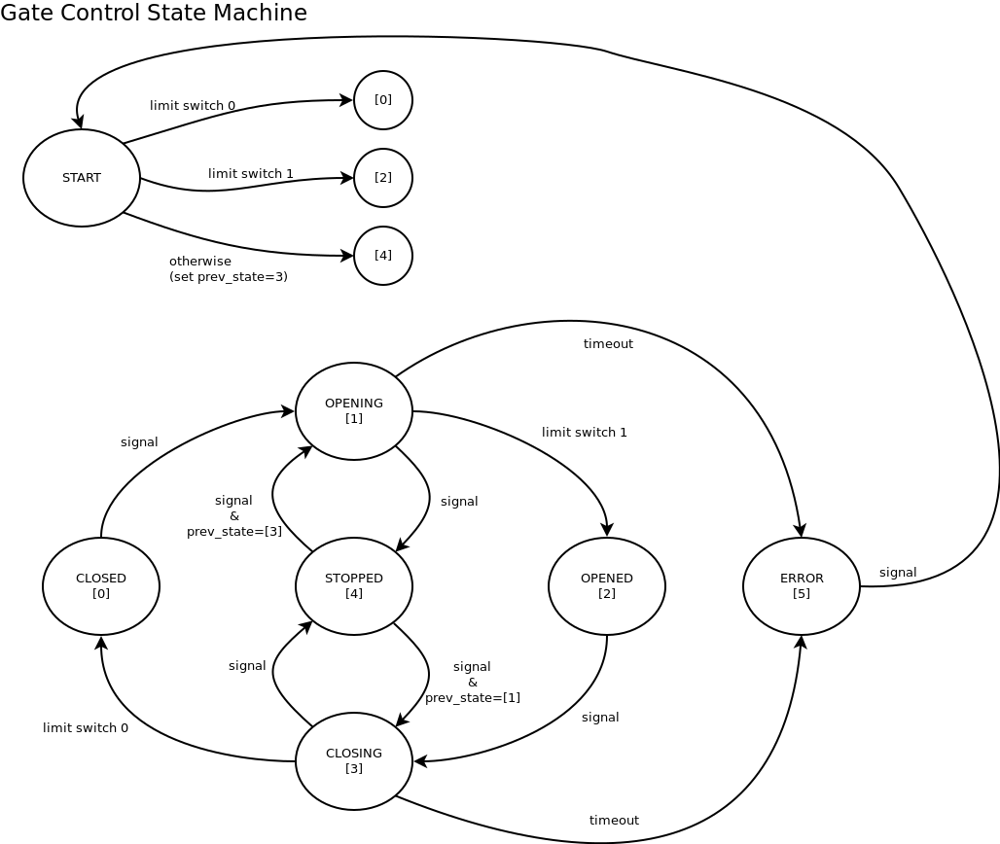

# Gate Motor Interface

Python interface to a gate motor controller using a microcontroller (uC).


## Dependencies

- **wxPython:** pip install wxPython
- **pyserial:** pip install pyserial

*In Linux run with __sudo__.*

*In Linux, running pyserial code could need __sudo__ or changing user groups as below:*

```sudo usermod -a -G dialout $USER```


## Instructions

- To connect to simulated uC, use **sep** as port name.

- Modify line 11 in `src/main.py` to run as simulation (program uses `src/uC_simulation.py` ) or to connect to a real microcontroller (using `src/uC_interface.py`).

- Modify communication functions in `src/uC_interface.py` to adjust to your own communication protocol while mantaining consistency with the states defined in `src/gate.py`, shown in the following state machine diagram (those states are interpreted in the GUI code in `src/main.py` to generate the animation).


## State Machine

 
 
 

